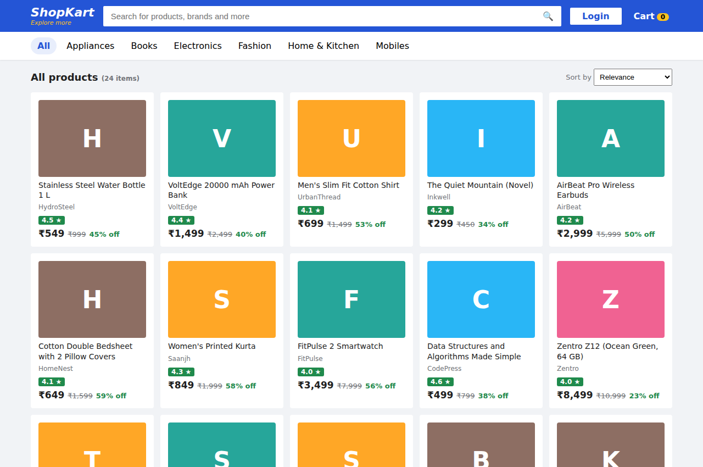
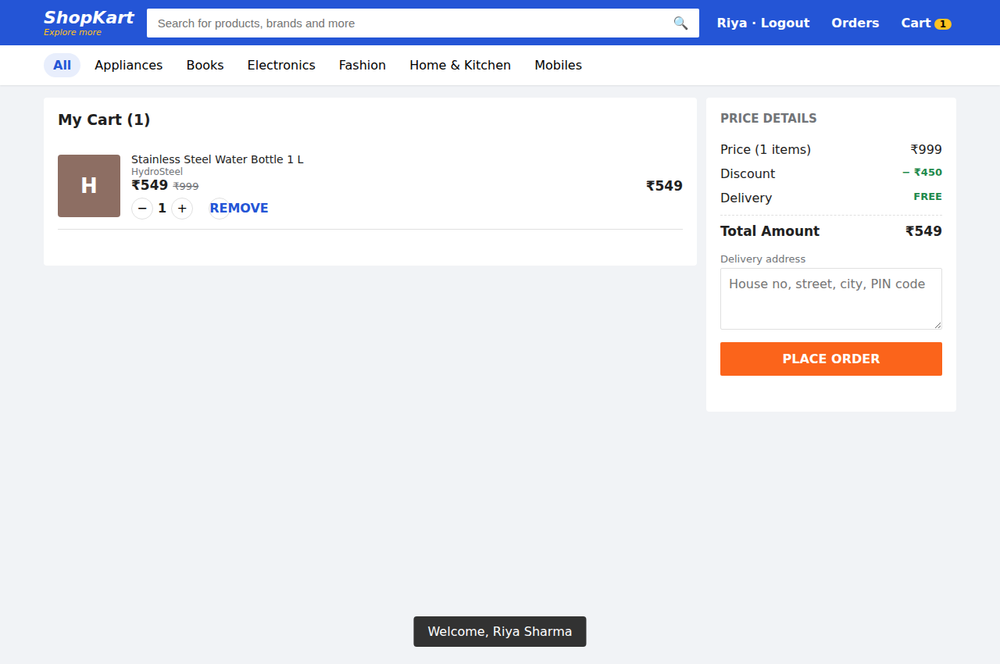
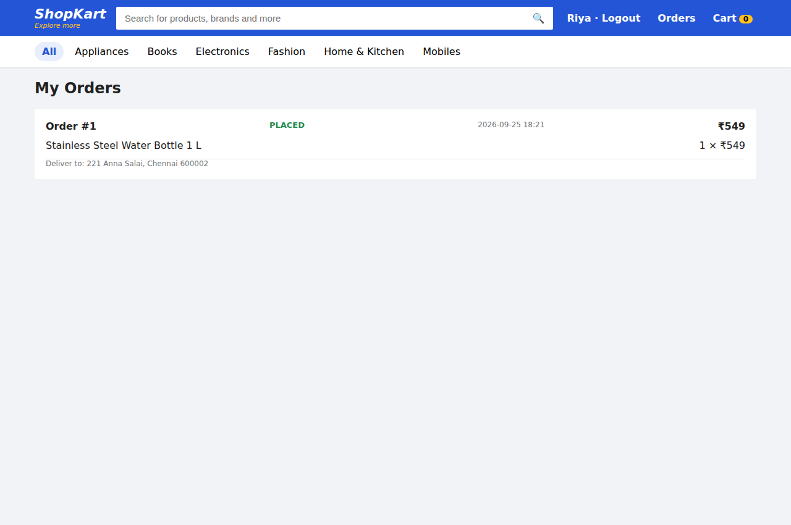
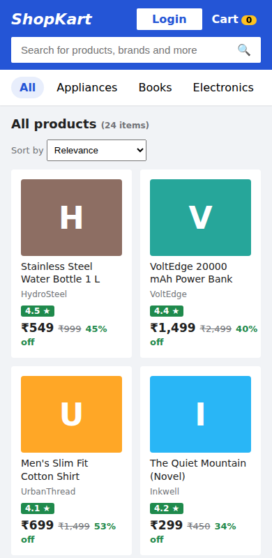

# ShopKart: a Flipkart-inspired E-Commerce Platform

   

A full e-commerce application with product browsing, search, cart and order flows. The UI is
a custom single-page front end; the back end is **plain Java with a JDBC data-access layer**
over a **normalised MySQL schema**. There is no framework, so every layer is hand-written and
visible.

**Stack:** Java 17 · JDBC · MySQL 8 (Apache Derby embedded for demo/tests) · JDK `HttpServer` · HTML/CSS/JS · JUnit 4 · Maven

## Highlights

- Complete shopping flow: **browse, search, cart, checkout, order history**, with a responsive front end.
- **Checkout runs in one database transaction**, so a failed line rolls back the whole order.
- **Secure by design:** salted PBKDF2 passwords, parameterised SQL everywhere, and an atomic stock check that stops two buyers from getting the last unit.
- Hand-written layers (HTTP → services → DAOs → JDBC) with **no framework**.

## Contents

[Features](#features) · [Architecture](#architecture) · [Database design](#database-design) · [Security](#security) · [Running it](#running-it) · [API](#api) · [Project layout](#project-layout) · [Author](#author) · [License](#license)



| Cart & checkout | Order history | Mobile |
|---|---|---|
|  |  |  |

---

## Features

- **Browse** by category, **search** across name, brand, description and category (multi-word, case-insensitive), **sort** by price, rating or discount, with pagination.
- **Product detail** with MRP, discount %, rating and live stock status.
- **Accounts**: register and log in. Passwords are hashed with salted **PBKDF2-HMAC-SHA256** and compared in constant time; sessions use random opaque tokens.
- **Cart**: add, change quantity, remove. Stock and per-item limits are validated.
- **Checkout** in a **single database transaction**: reserve stock for every line → create order + items → empty cart → commit. If any line fails, *everything* rolls back.
- **Order history** that stays correct when the catalogue changes (see below).

## Architecture

```
Browser (index.html SPA)
   │  fetch() JSON / form-encoded
   ▼
web/ApiServer          routing, status codes, JSON (web/Json)
   ▼
service/*Service       business rules, transactions   ← AuthService, CatalogService, CartService, OrderService
   ▼
dao/*Dao               SQL only, PreparedStatement    ← UserDao, ProductDao, CartDao, OrderDao
   ▼
JDBC ─► MySQL (prod) / Derby (demo, tests)
```

SQL lives only in the DAO layer and business logic lives only in services. A DAO method takes
the caller's `Connection`, so a service can compose several DAO calls into one transaction
(checkout does exactly this).

## Database design

```
categories 1──* products 1──* cart_items *──1 users
                    │                            │
                    └──* order_items *──1 orders *┘
```

| Table | Notes |
|---|---|
| `users` | unique email, PBKDF2 hash (never plaintext) |
| `categories` | unique name |
| `products` | FK → categories; `CHECK (stock >= 0)`, `CHECK (price <= mrp)`; indexes on category and name |
| `cart_items` | composite PK `(user_id, product_id)`, so one line per product |
| `orders` | FK → users; index `(user_id, created_at)` for history queries |
| `order_items` | composite PK; **`product_name` and `unit_price_paise` are snapshots** |

**Why snapshots?** If a product is repriced or renamed after purchase, a join to `products`
would silently rewrite the customer's past invoices. Storing what was actually charged keeps
order history consistent. There's a test for exactly this case.

Money is stored as `BIGINT` paise, never floating point.

## Security

- **SQL injection:** every query is a `PreparedStatement` with bound parameters. The only dynamic SQL (sort order, pagination syntax) comes from fixed whitelists and never from user input. Tests search for `' OR '1'='1` and `'; DROP TABLE products; --` and check that both are treated as plain text.
- **LIKE wildcards** in search terms (`%`, `_`) are escaped, so a search for `%` finds products that literally contain "%" rather than every product.
- **Stock race:** `UPDATE products SET stock = stock - ? WHERE product_id = ? AND stock >= ?` checks and decrements in one atomic statement, so two buyers cannot both get the last unit.
- **Login** returns the same message for unknown email and wrong password, so it doesn't reveal which emails are registered.
- **XSS:** the front end escapes all server data before inserting it into the page; JSON output escapes `<`.

## Running it

Requires JDK 17+ and Maven.

```bash
mvn test                  # 19 tests: services, DAOs, and end-to-end over HTTP
mvn -q compile exec:java  # http://localhost:8080 with an in-memory database and a seeded catalogue
```

### Against MySQL

```bash
docker compose up -d
export SHOPKART_DB_URL="jdbc:mysql://localhost:3306/shopkart"
export SHOPKART_DB_USER=shop SHOPKART_DB_PASSWORD=shop
mvn -q compile exec:java
```

Tables are created and the demo catalogue is seeded on first start
(`src/main/resources/schema-mysql.sql`).

## API

| Method & path | Auth | Purpose |
|---|---|---|
| `GET /api/categories` | – | list categories |
| `GET /api/products?q=&category=&sort=&page=&size=` | – | browse / search |
| `GET /api/products/{id}` | – | product detail |
| `POST /api/register` `email,name,password` | – | create account and log in |
| `POST /api/login` `email,password` | – | returns `token` |
| `POST /api/logout` | ✓ | end session |
| `GET /api/cart` | ✓ | view cart |
| `POST /api/cart/add` `productId,quantity` | ✓ | add to cart |
| `POST /api/cart/update` `productId,quantity` | ✓ | set quantity (0 removes) |
| `POST /api/checkout` `address` | ✓ | place order |
| `GET /api/orders` | ✓ | order history |

The token is sent in the `X-Auth-Token` header. Errors are `{"error": "..."}` with 400/401/404/409.

## Project layout

```
src/main/java/com/shopkart/
  ShopKartApp.java     entry point
  web/                 ApiServer (HTTP + routing), Json
  service/             Auth, Catalog, Cart, Order services; PasswordHasher
  dao/                 UserDao, ProductDao, CartDao, OrderDao
  model/               records: User, Product, Cart, Order, ...
  db/                  Database (JDBC + schema bootstrap), SeedData
src/main/resources/
  schema-mysql.sql, schema-derby.sql, static/index.html
src/test/java/com/shopkart/
  ShopKartTest         auth, search, cart, checkout rollback, price snapshots, injection
  ApiServerTest        full register → cart → checkout → orders flow over real HTTP
```

*This is a learning project. "Flipkart-inspired" describes the feature set only; the ShopKart
name, brands and catalogue are fictional.*

## Author

**Gorika Shukla** · GitHub [@gorikashukla17-wq](https://github.com/gorikashukla17-wq)

## License

Released under the [MIT License](LICENSE).
